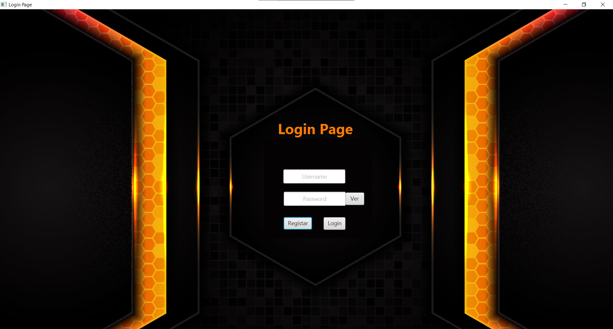
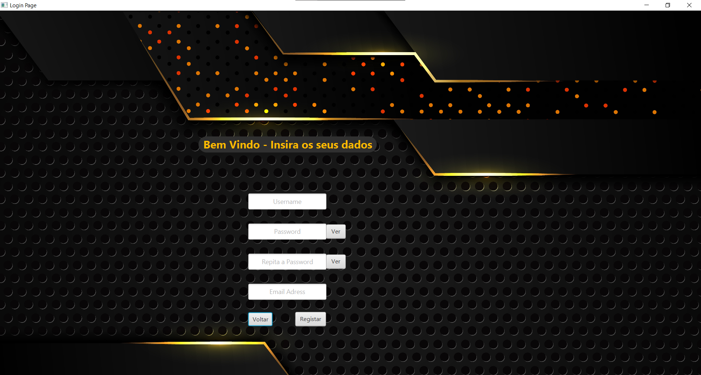
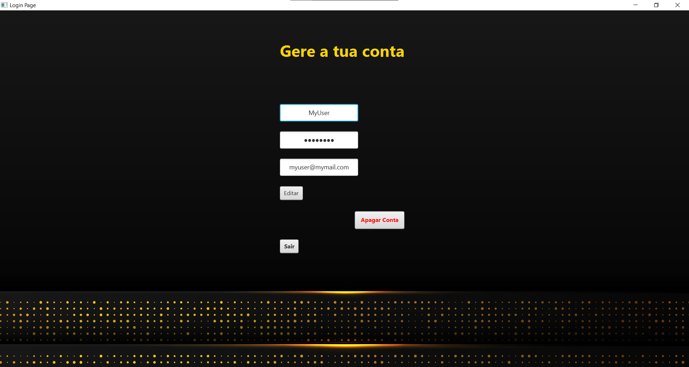

# Login_Page

 Permite o registo de um Utilizador numa base de dados, permitindo o acesso à sua conta através de uma página de Login e desta forma ser redirecionado a uma página de gestão de conta onde será permitido a atualização dos dados pessoais e de apagar por completo a sua conta.

 

 

